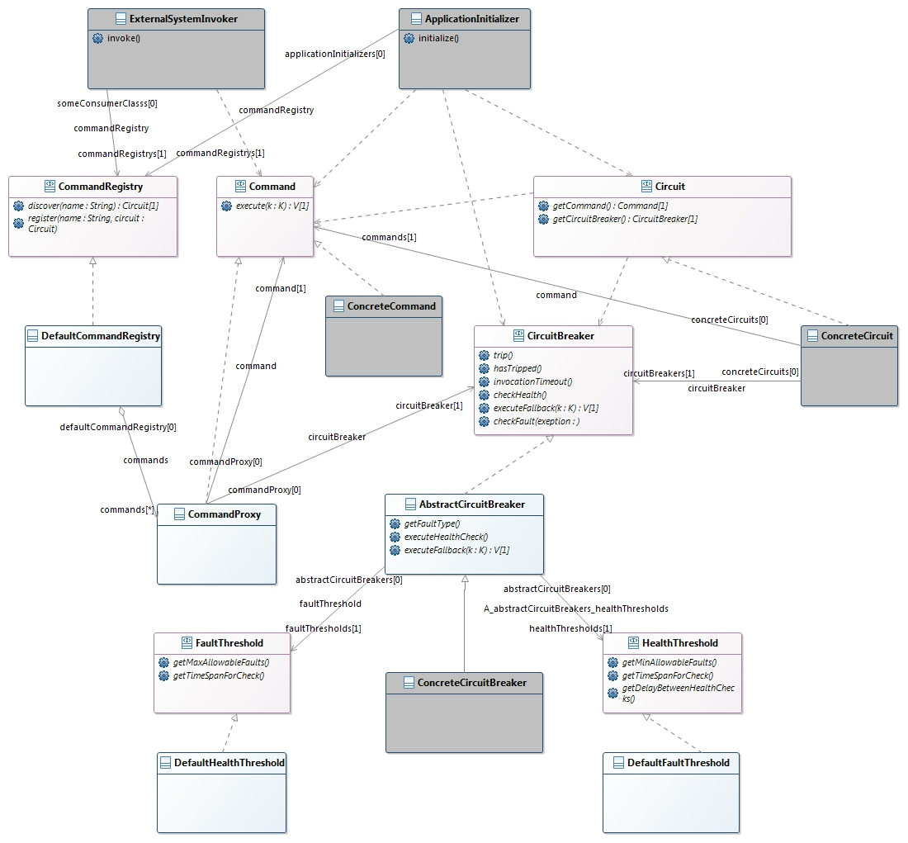

## Synopsis

This is a small circuit-breaker framework implementing circuit breaker design pattern. Generate the javadoc to look into its details. Refer to https://martinfowler.com/bliki/CircuitBreaker.html for more detail understanding.

## Design

## API Details

The framework contains set of interfaces. The key interfaces are Circuit, CircuitBreaker and Command. The Circuit wraps the latter two. When a Command that encapsulate a remote service call fails repeatedly and crosses a threshold in a given time, the circuit breaker trips the circuit and bypass all calls to the remote service to another fallback path. Meanwhile it watches till the external system is healthy again. When the external system is up, then the circuit is again restored. 

Each remote system interface will have a Circuit created with a Command and CircuitBreaker implementation. The developer can implement Command and extend the framework provided AbstractCircuitBreaker. Each Circuit need to be registered to the CommandRegistry during initialization of the application, and then the Command associated with the Circuit can be resolved by the unique name of the Circuit.

## Build
mvn test
 - This will run the junit test case. The test case fires 1000 invocations to a simulated remote service interface. The mock service will by up till first 15 seconds then gradually fails and then after 30 seconds becomes unresponsive. After 90 seconds it will be automatically up and healthy again.
  
mvn clean install
 - This will create the circuit-breaker jar file in target folder.

mvn cobertura:cobertura
 - This will generate code coverage report file target/site/cobertura/index.html

